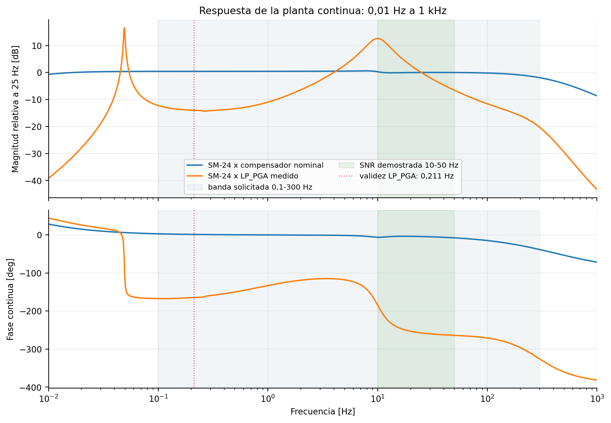
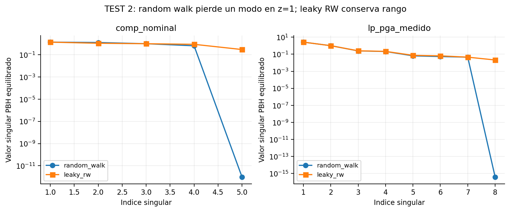
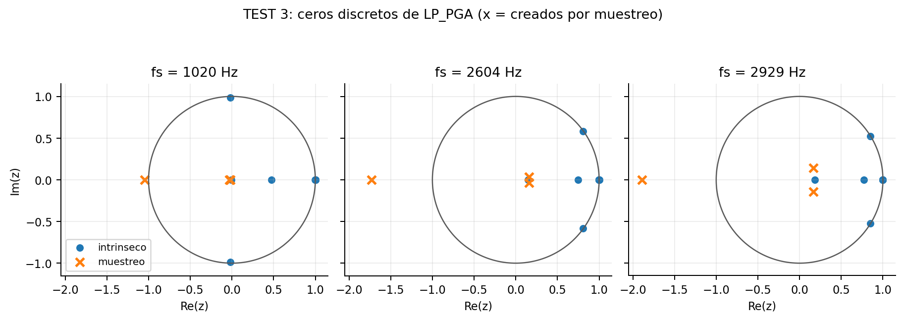
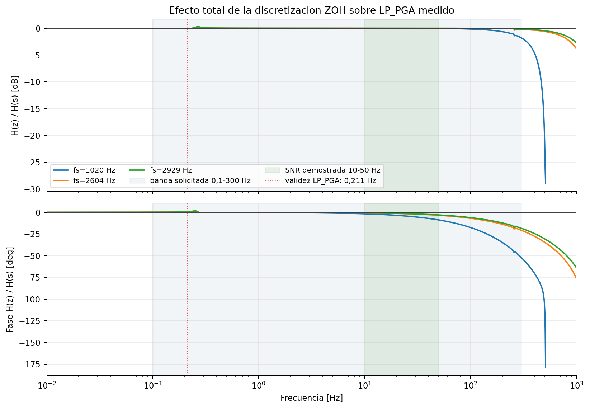
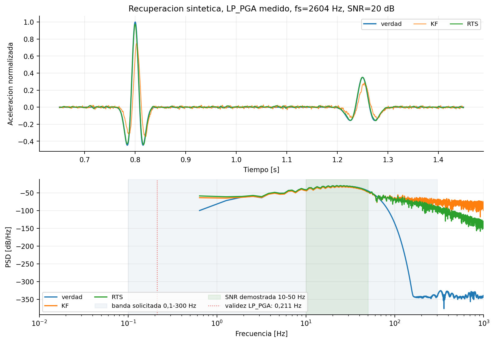

# Informe parcial S2 — discretizacion, observabilidad y KF+RTS

Fecha: 2026-08-17. Resultados regenerables desde `src/interfaces/python`.

## Alcance de banda

Los graficos espectrales cubren **0,01 Hz a 1 kHz**. Se analiza la banda 
solicitada de **0,1 a 300 Hz**, pero se mantienen dos limites independientes:

- el ajuste `lp_pga_medido` solo es defendible desde **0,211 Hz**; 0,1-0,211 Hz se muestra, no se valida;
- las capturas existentes solo demostraron SNR util de manera empirica en **10-50 Hz**.



## TEST 1 — retardo estructural

| Planta | Grado relativo teorico | Detectado por Markov | Retardo minimo L |
|---|---:|---:|---:|
| comp_nominal | 2 | 2 | 2 |
| lp_pga_medido | 4 | 4 | 4 |

El estimador instantaneo no aplica. El procesamiento offline permite absorber L=2/L=4 mediante RTS.

## TEST 2 — observabilidad en DC

| Planta | random_walk | leaky_rw (0,7 Hz) |
|---|---:|---:|
| comp_nominal | 4/5 | 5/5 |
| lp_pga_medido | 7/8 | 8/8 |

`random_walk` pierde exactamente un modo en z=1. `leaky_rw` conserva rango completo: no hace falta pasar a Dual KF para el default.

**Criterio 2.4 aun abierto:** la fuga de 0,7 Hz acota DC, pero el prior AR(1) no es plano en 10-50 Hz: su magnitud cae 13,95 dB en esa banda. Es un prior rojo. No invalida la observabilidad, pero obliga a justificar Q o a evaluar un prior alternativo en S3.



## TEST 3 — ceros de muestreo (`lp_pga_medido`)

| fs [Hz] | max abs(z) de muestreo | ceros de muestreo inestables |
|---:|---:|---:|
| 1020 | 1.045683 | 1 |
| 2604 | 1.732197 | 1 |
| 2929 | 1.891480 | 1 |

**1020 Hz es la mejor de las tres fs para la inversion**: su cero de muestreo inestable queda en |z|=1,0457, frente a 1,7322 y 1,8915. Sigue siendo no minimo, pero mucho menos severo.



## Discretizacion ZOH

| fs [Hz] | banda evaluada [Hz] | directo [dB] | directo [deg] | sin ZOH [dB] | sin ZOH [deg] |
|---:|---:|---:|---:|---:|---:|
| 1020 | 0,1-204.0 | 0.6845 | 35.538 | 0.1053 | 0.462 |
| 2604 | 0,1-300.0 | 0.1993 | 20.736 | 0.0088 | 0.007 |
| 2929 | 0,1-300.0 | 0.1555 | 18.430 | 0.0051 | 0.007 |

La equivalencia de magnitud cumple, pero el criterio directo de fase de 2 grados no puede cumplirse sin quitar el medio periodo del retenedor ZOH. Al remover sinc+retardo del retenedor, el error residual cae a centesimas de dB y grado. El checklist conserva esta fila abierta hasta corregir formalmente el criterio.



## Banco sintetico KF+RTS

Configuracion principal: `lp_pga_medido`, fs=2604 Hz, SNR=20 dB, Ricker 25 Hz + pulso 16 Hz, prior `leaky_rw`.

| Metrica | KF | RTS |
|---|---:|---:|
| RMSE alineado / RMS verdad | 27.212% | 7.905% |
| Retardo | 9 muestras | 0 muestras |
| Relacion de amplitud | 0.7523 | 0.9832 |
| Error de fase 10-50 Hz | +1.560 deg | -0.109 deg |
| Mejora de RMSE RTS vs KF | — | 70.980% |

Covarianzas positivas: min eig KF=2.460e-13, RTS=2.460e-13. Con 5% de NaN la salida permanece finita. Simular con la planta completa y estimar con la reducida da 7,907% de RMSE, practicamente igual al 7,905% principal.



## Hallazgo de Q/R que pasa a S3

Con q optimizado para recuperacion (`q=0.190863`), el RTS cumple RMSE pero el NIS queda fuera del IC95 (5785.2 vs [3989.0, 4346.8]). Con q oraculo para consistencia (`q=0.668022`), el NIS pasa (4244.9) pero el RMSE RTS sube a 11.14%. No se esconde: es el compromiso que S3 debe resolver con ML, L-curve y la suite anti-invencion.

El ajuste oraculo simple de NIS paso a 2604 y 2929 Hz, pero quedo fuera por abajo a 1020 Hz (1476,5 frente a [1521,9; 1745,9]); por eso la fila 2.9 no se cierra aun para las tres fs.

## Fase no minima

El inverso causal directo diverge: al duplicar N, su norma crece por un factor `1.486e+59`. KF+RTS permanece acotado. Esto confirma empiricamente que el cero RHP/los ceros de muestreo requieren inversion no causal.

## Conclusion

La formulacion aumentada queda habilitada con `leaky_rw`; no se justifica migrar aun a Dual KF. La recomendacion estructural provisoria para deconvolucion es **fs=1020 Hz**, sujeta a verificar en S3/S4 que la menor severidad del cero de muestreo compense la menor Nyquist sobre datos reales. El nucleo S2 queda funcional, pero no cerrado: siguen abiertas la definicion del gate continuo-vs-ZOH, la falsa premisa de planitud del prior `leaky_rw` y la consistencia NIS a 1020 Hz.

## Comandos clave

```bash
python -m geophone_scope.kalman_deconv.cli markov --cond lp_pga_medido
python -m geophone_scope.kalman_deconv.cli check-obsv --input-model random_walk
python -m geophone_scope.kalman_deconv.cli check-obsv --input-model leaky_rw
python -m geophone_scope.kalman_deconv.cli sampling-zeros --fs 1020 --fs 2604 --fs 2929
python -m geophone_scope.kalman_deconv.cli bench --case ricker25 --fs 2604 --snr 20
python -m geophone_scope.kalman_deconv.report_s2 --output geophone_scope/kalman_deconv/reports/s2_2026-08-17
```
